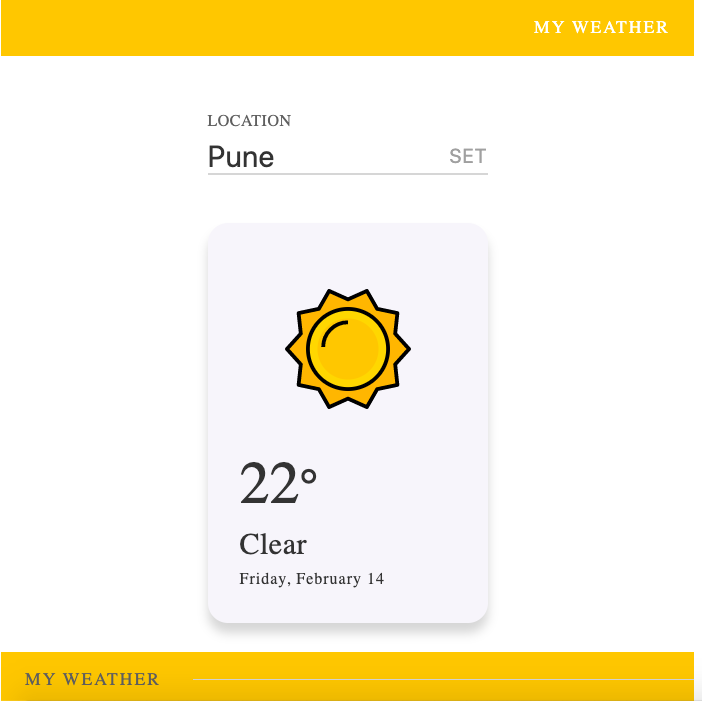

#### Implemented a Fetch Weather Details app in Reactjs.
1. All the components are structured under Components folder.
2. All reusable elements are under Elements folder.
3. Stateful component is created under Containers folder.

##### Check the app for testing purposes here : http://35.226.203.119/
